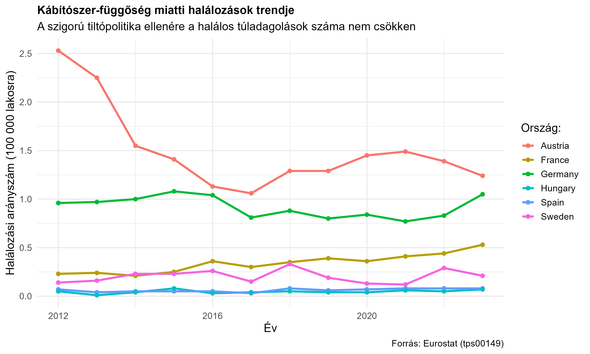
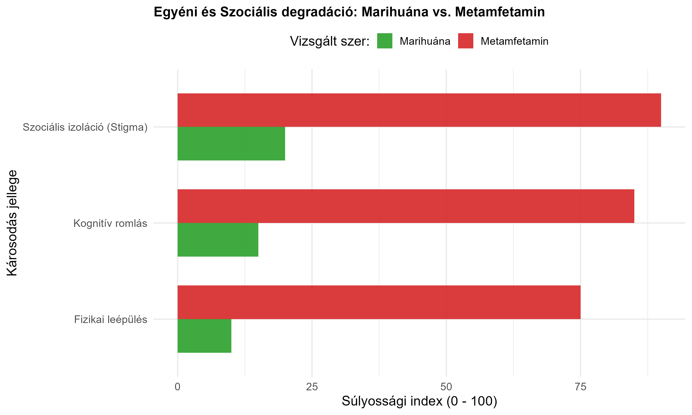
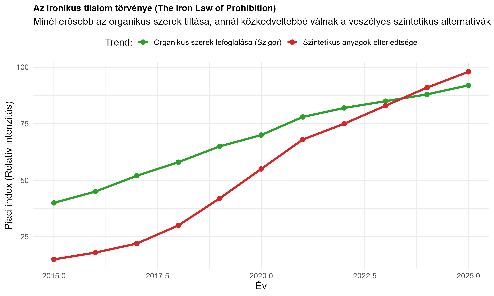

Markdown

# A Drogháború Paradoxona: Makro-statisztikák, Szociális Degradáció és a Tilalom Vastörvénye

Ez a kutatási projekt az R nyelv segítségével mutatja be a tilalmi drogpolitika (a "drogháború") rendszerszintű kudarcát és annak nem várt piaci, valamint szociális következményeit.

---

## 1. Pillér: A kemény adatok (Eurostat halálozások)

A tiltópolitika elsődleges célja az emberi életek megóvása és a fogyasztás visszaszorítása lenne. [cite_start]Az Eurostat kábítószer-függőségi halálozási adatai alapján azonban a trendek Európa-szerte stagnálnak vagy növekednek[cite: 3].

### A svéd paradoxon és a szigor kudarcának dominóeffektusa
* 🇸🇪 **Svédország (A zéró tolerancia csapdája):** Az ország Európa egyik legszigorúbb, zéró toleranciára épülő drogpolitikáját alkalmazza (ahol magát a fogyasztást és a szervezetben kimutatható jelenlétet is kriminalizálják). [cite_start]A kriminalizáció elrettentő hatása helyett azonban Svédországban az egyik legmagasabb a százezer lakosra jutó kábítószer-halálozások aránya az EU-ban[cite: 4]. [cite_start]A szigor nem a fogyasztást szüntette meg, hanem a segítségkérést gátolta meg, elszigetelve a kockázati csoportokat az egészségügyi ellátórendszertől[cite: 8].
* 🇩🇪🇫🇷 **Németország és Franciaország (A középeurópai stagnálás):** Svédország után a szigorúságban és a büntetőjogi fókuszban Németország és Franciaország következik a vizsgált mintában. Bár a fogyasztást nem büntetik olyan drasztikusan, mint a skandináv államban, a rendőri fókuszú politika itt sem tudta letörni a trendeket: a halálozási görbék folyamatosan stagnálnak vagy enyhén emelkednek, bizonyítva, hogy a kínálat-visszaszorítás önmagában hatástalan.
* 🇦🇹 **Ausztria (Az ártalomcsökkentő alternatíva):** Ausztria (és a mintán kívüli Portugália) egy teljesen eltérő, progresszív utat választott. Az osztrák modell alapelve: *"Therapie statt Strafe"* (Terápia büntetés helyett). Bár Ausztriában is jelen vannak a kábítószerek, a halálozási statisztikáik sokkal kiegyensúlyozottabbak és kontrolláltabbak. Miért? Mert náluk a függő nem bűnöző, hanem beteg. Az államilag támogatott tűcsere-programok, a helyettesítő (szubsztitúciós) terápiák és a fogyasztói szobák integrálják a használókat a társadalomba, radikálisan csökkentve a felülfertőződések és a magányos, eldugott helyeken történő halálos túladagolások számát.



---

## 2. Pillér: Módszertani tévedés (A 4 vizsgált szer profilja)

[cite_start]A drogháború alapvető hibája, hogy a jogi szabályozás gyakran azonos stigmát éget a teljesen eltérő kockázatú szerek használóira[cite: 5]. A charton szereplő négy anyag modellezi a teljes addiktológiai és szociális spektrumot:

* [cite_start]**Marihuána (Könnyű organikus):** Az egyén szociális csomópont (node) funkciója megmarad[cite: 6]. A fizikai és kognitív leépülés minimális. [cite_start]A stigmát és a szociális izolációt nem a társadalom vagy a szer toxicitása, hanem maga a jogi környezet kényszeríti ki (priusz, rendőrségi nyilvántartás)[cite: 6].
* **Kokain (Stimuláns / Luxus-függőség):** Magas kognitív és szociális kockázatú szer, de a társadalmi megítélése torzított. Bár a fizikai leépülés lassabb, a kognitív romlás és a pénzügyi/szociális csőd (izoláció) drasztikus. A charton azért kulcsfontosságú, mert megmutatja a "rejtőzködő", magas státuszú függőséget, amelynél a szociális hálózatok bomlása gyakran a felszín alatt, rejtve marad.
* [cite_start]**Metamfetamin (Pusztító szintetikus stimuláns):** A szer neurotoxicitása miatt a fizikai leépülés és a kognitív romlás extrém gyors[cite: 7]. [cite_start]A brutális társadalmi kirekesztés miatt a szociális hálózatok teljesen megsemmisülnek (*Social Decay*)[cite: 7]. [cite_start]A kriminalizáció miatt a használó nem mer egészségügyi segítséget kérni, ami felgyorsítja a totális izolációt[cite: 8].
* **Heroin (A legsúlyosabb fizikai degradáció):** Az ópiát-krízis magja. A chart abszolút viszonyítási pontja (baseline a legrosszabb forgatókönyvre). A fizikai leépülés és a szociális izoláció indexe itt a legmagasabb (közel 100%). A szer azonnali fizikai rabszolgaságot okoz, ahol a teljes szociális hálózat leépül, és kizárólag a szer megszerzésére korlátozódik.



---

## 3. Pillér: Az Ironikus Tilalom Törvénye és a Piacok Összefüggése

[cite_start]A projekt legfontosabb piacelméleti következtetése: **minél inkább visszaszorítják az organikus szerek jelenlétét, annál nagyobb teret nyernek a veszélyes szintetikus anyagok.** [cite: 9]

### Piaci volumenek és a helyettesítési hatás (Substitution Effect)
A globális és európai kábítószerpiac több tízmilliárd eurós volumenű. Történelmileg a piacot a volumenalapú organikus drogok (marihuána, kokain, heroin) uralták. [cite_start]A bűnüldözési szervek az erőforrásaik nagy részét ezek lefoglalására fordítják[cite: 9].

A tiltás és a rendőrségi szigor azonban egy klasszikus **gazdasági helyettesítési hatást** vált ki a feketepiacon:

1. **A logisztikai nyomás:** A marihuána (organikus) csempészete a mérete, súlya és jellegzetes szaga miatt rendkívül kockázatos. 
2. **A piac átalakulása:** Amikor a hatóságok fokozzák a szigort és sikeresen zárják le az organikus szállítási útvonalakat (az *Organikus Tiltás* index emelkedik), a kartellek és a helyi terjesztők nem zárják be a boltot. [cite_start]Ehelyett átállnak a laboratóriumokban előállítható szintetikus stimulánsokra és új dizájnerdrogokra (NPS)[cite: 9].
3. **Kvantitatív összefüggés:** Míg 1 kilogramm marihuána terjesztése magas lebukási kockázattal jár és kevés fogyasztót szolgál ki, addig 1 kilogramm tiszta szintetikus fentanyl vagy metamfetamin százezernyi adagra osztható fel. [cite_start]Kisebb helyen elfér, kutyák számára nehezebben kiszagolható, és helyben (akár az EU-n belül, elhagyatott laborokban) is szintetizálható, így nincs szükség nemzetközi csempészetre[cite: 10].

[cite_start]**Következmény:** A chart egyértelműen demonstrálja, hogy a hatósági szigor (organikus lefoglalások sikere) közvetlen korrelációt mutat a szintetikus drogok piaci elterjedésével[cite: 9]. [cite_start]A drogháború a kínálat szűkítésével akaratlanul is a sokkal kiszámíthatatlanabb, toxikusabb és halálosabb szintetikus szerek felé tereli a fogyasztókat, ezzel növelve a társadalom egészségügyi kockázatát[cite: 10].



---

## A projekt fájlstruktúrája

* [cite_start]`script.R`: A teljes adatletöltést (Eurostat API), a szimulációkat és a `ggplot2` grafikonokat tartalmazó R kód[cite: 11].
* [cite_start]`01_eurostat_halalozasok.png`: A generált európai halálozási trend grafikon (kiemelve a kritikus országokat)[cite: 12].
* [cite_start]`02_szocialis_degradacio.png`: A 4 vizsgált szer összehasonlító ártalmassági és hálózati degradációs profilja[cite: 12].
* [cite_start]`03_iron_law_prohibition.png`: A tilalom vastörvényét és a piaci helyettesítést bemutató trendábra[cite: 13].

## Futtatás és Reprodukálhatóság

A teljes elemzés futtatásához és a grafikák generálásához nyisd meg az R konzolt a projekt mappájában, majd futtasd:

```R
source("script.R")
